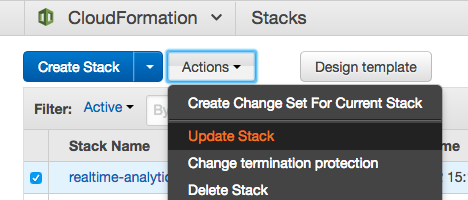
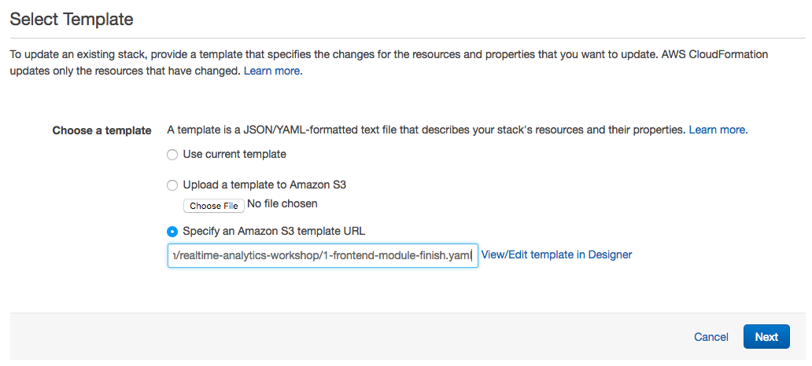
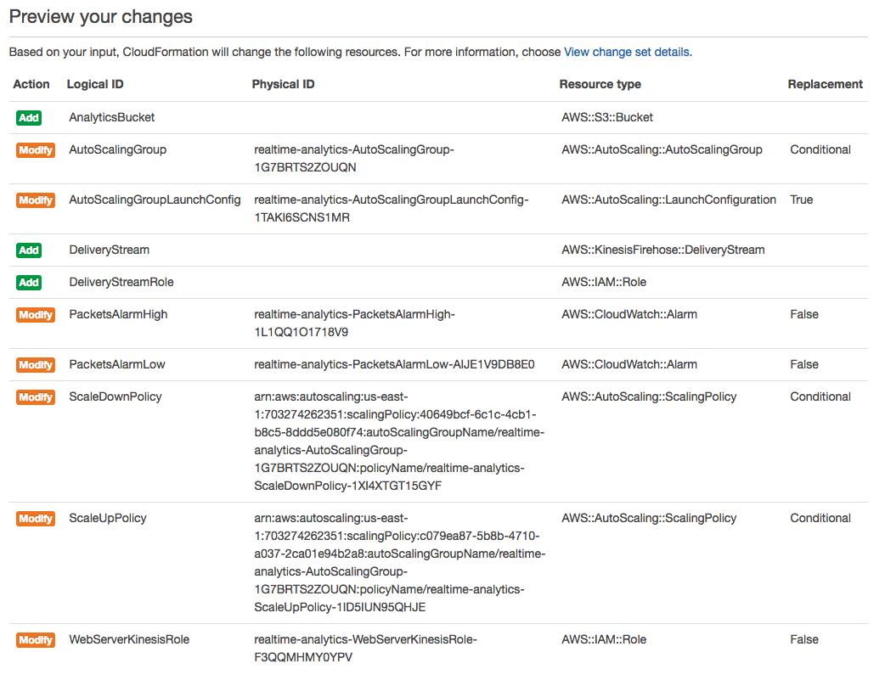
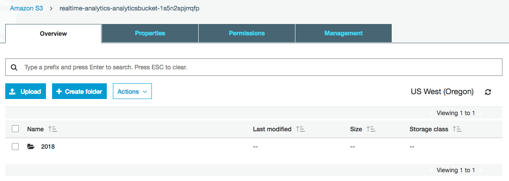

#  Configure a fleet of Web Servers to send Clickstream data to a Kinesis Firehose delivery stream

## Introduction

In this module, you will start with an AutoScaling group of Apache web servers, and configure them to stream their log data in realtime to a Kinesis Firehose delivery stream. This will prepare for us to perform realtime analytics on the events being captured in these logs.

## Architecture Overview


## 1. Deploy Web Servers using CloudFormation Template

First we need to deploy our web servers in an AutoScaling group, with an Application Load Balancer to accept incoming connections, and scaling policies to scale out (and back in) based on incoming network traffic.

<details>
<summary><strong>CloudFormation Launch Instructions (expand for details)</strong></summary><p>

1.	Right click the **Launch Stack** link below and "open in new tab"

Region| Launch
------|-----
US West (Oregon) | [](https://console.aws.amazon.com/cloudformation/home?region=us-west-2#/stacks/new?stackName=realtime-analytics-workshop&templateURL=https://s3-us-west-2.amazonaws.com/realtime-analytics-workshop/1-frontend-module-start.yaml)
US West (N. Virginia) | [](https://console.aws.amazon.com/cloudformation/home?region=us-east-1#/stacks/new?stackName=realtime-analytics-workshop&templateURL=https://s3-us-west-2.amazonaws.com/realtime-analytics-workshop/1-frontend-module-start.yaml)

2.	Click **Next** on the Select Template page.
3.	**(Optional)** If you'd like to login to the web servers, select an **SSH Keypair** for this region, select True next to **Enable SSH**, and enter a CIDR block such as `0.0.0.0/0` next to **Enable SSH From**. If you don't have a key pair already created, see ([Creating a key pair using amazon EC2](http://docs.aws.amazon.com/AWSEC2/latest/UserGuide/ec2-key-pairs.html#having-ec2-create-your-key-pair))


4.	Click **Next**.
5.	Click **Next** Again. (skipping IAM advanced section)
6.	On the Review page, check the box to acknowledge that CloudFormation will create IAM resources and click **Create**.


7. While you wait for the CloudFormation stack to be created, download the CloudFormation template by right-clicking here and selecting **Save Link As...**: ([Module 1 Starting Template](https://s3-us-west-2.amazonaws.com/realtime-analytics-workshop/1-frontend-module-start.yaml))

</p></details>

## 2. Add the Kinesis Resources by updating the existing CloudFormation Stack

During this step, we'll illustrate how you would take an existing group of web or application servers and enable them to stream events to Amazon Kinesis.  You're going to update the CloudFormation stack and reconfigure the AutoScaling Group's Launch Configuration to enable the Kinesis agent to load at startup, and configure it to parse the Apache web server's access logs, and publish them to a new Kinesis delivery stream.

<details>
<summary><strong>CloudFormation Update Instructions (expand for details)</strong></summary><p>

1.  Use your previously downloaded copy of the updated CloudFormation template from here (this was downloaded to the `realtime-web-analytics-workshop/module-1/` folder when you cloned the GitHub repository): ([Module 1 Final Template](1-frontend-module-finish.yaml))

2.  Navigate in the AWS Console to **Services**, **CloudFormation**, and select the stack titled `realtime-analytics-workshop`, then select **Actions**, **Update Stack**:



3.  Select the **Upload a template to Amazon S3** radio button, then click the **Choose File** button, and select the CloudFormation template you edit in the previous section:



4.  On the **Parameters** page, you can leave all fields unmodified, and click **Next**.
5.  Click **Next** Again. (skipping IAM advanced section)
6.  On the Review page, take a moment to review the changes that will be made to your existing CloudFormation stack.  This is an important step to ensure that you are modifying the resources in a way that you expect, and that there are no unintended changes being introduced to your CloudFormation stack.  The resource change set should look like this:



7.  Check the box to acknowledge that CloudFormation will create IAM resources and click **Update**.


8. While you wait for the CloudFormation stack to be updated, review the changes we made to each section of the CloudFormation template by expanding each details section below.  You can also review the events as the CloudFormation stack updates and watch how AutoScaling performs the rolling upgrade of your existing web servers according to the Update Policy.  

When you see the stack showing a **UPDATE_COMPLETE** status, you are ready to move on to the next module.

</p></details>

## 3. (Optional) Review the Kinesis Resources that were added to the CloudFormation stack

### Note: There is no need to make any of these edits; you are simply reviewing them to see what changed.

1.  The first thing that was added to the stack was an S3 analytics bucket resource, as well as a Kinesis Firehose Delivery Stream that will deliver events to it.  

<details>
<summary><strong>AnalyticsBucket Resource (expand for code)</strong></summary>

```YAML
# Kinesis Application
  AnalyticsBucket:
    Type: AWS::S3::Bucket
    DeletionPolicy: Retain
```

</details>

2.	The next thing that was added to the stack was an IAM Role and Policy that will give the Kinesis Delivery Stream permissions to deliver the events directly below the S3 bucket resource:  

<details>
<summary><strong>DeliveryStreamRole Resource (expand for code)</strong></summary>

```YAML
  DeliveryStreamRole:
    Type: AWS::IAM::Role
    Properties:
      AssumeRolePolicyDocument:
        Version: '2012-10-17'
        Statement:
          - Effect: Allow
            Principal:
              Service:
                - firehose.amazonaws.com
            Action:
              - sts:AssumeRole
      Policies:
        - PolicyName: s3Access
          PolicyDocument:
            Version: '2012-10-17'
            Statement:
              - Sid: ''
                Effect: Allow
                Action:
                  - s3:AbortMultipartUpload
                  - s3:GetBucketLocation
                  - s3:GetObject
                  - s3:ListBucket
                  - s3:ListBucketMultipartUploads
                  - s3:PutObject
                Resource:
                  - !Sub '${AnalyticsBucket.Arn}'
                  - !Sub '${AnalyticsBucket.Arn}/*'
              - Sid: ''
                Effect: Allow
                Action:
                  - logs:PutLogEvents
                Resource:
                  - !Sub 'arn:aws:logs:${AWS::Region}:${AWS::AccountId}:log-group:/aws/kinesisfirehose/*:log-stream:*'
```
Note: We are following the _principle of least privilege_ by enabling resource-level permissions and referencing the `AnalyticsBucket` as `!Sub '${AnalyticsBucket.Arn}'`

</details>

3. We also added a Kinesis Delivery Stream resource directly below the IAM Role:  

<details>
<summary><strong>DeliveryStream Resource (expand for code)</strong></summary>

```YAML
  DeliveryStream:
    Type: AWS::KinesisFirehose::DeliveryStream
    Properties:
      DeliveryStreamType: DirectPut
      S3DestinationConfiguration:
        BucketARN: !Sub '${AnalyticsBucket.Arn}'
        BufferingHints:
          IntervalInSeconds: '60'
          SizeInMBs: '1'
        CompressionFormat: UNCOMPRESSED
        RoleARN: !GetAtt 'DeliveryStreamRole.Arn'
```
Note: By setting `IntervalInSeconds` to `60` and `SizeInMBs` to `1`, we are configuring the Kinesis Delivery Stream to deliver events to the S3 bucket whenever either 60 seconds has elapsed, or more than 1MB of event data is in the stream.  Whenever either of these conditions is met, the events will be delivered.

</details>

</p></details>

## 4. (Optional) Review how the Kinesis Agent was configured on the AutoScaling Group of Web Servers

### Note: There is no need to make any of these edits; you are simply reviewing them to see what changed.

Every AutoScaling Group has a Launch Configuration that is used to configure the EC2 instances when they are launched.  In these code changes, we modified the existing Launch Configuration in the CloudFormation template, configuring the Kinesis agent to install, start automatically on boot, and stream Apache log events to the Kinesis Delivery Stream that we created in the previous section.  We also modified the EC2 instance IAM role to give the EC2 instances permission to send events to the Kinesis Delivery Stream.

<details>
<summary><strong>AutoScaling Launch Configuration changes (expand for details)</strong></summary><p>

1.  In the LaunchConfiguration resource, in the `Metadata` section, under `AWS::CloudFormation::Init`, `config`, `packages`, and `yum`, we added a line that contains `aws-kinesis-agent: []` 

<details>
<summary><strong>See this edit in context (expand for code)</strong></summary>

```YAML
<line 332>
  AutoScalingGroupLaunchConfig:
    Type: AWS::AutoScaling::LaunchConfiguration
    Metadata:
      AWS::CloudFormation::Init:
        config:
          packages:
            yum:
              httpd: []
              aws-kinesis-agent: []
          files:
<line 343>
```

</details>

2.  In the `files` section of the same resource, directly underneath `packages`, we added the file `/etc/aws-kinesis/agent.json` with the following configuration:

<details>
<summary><strong>See this edit in context (expand for code)</strong></summary>

```YAML
<line 337>
          packages:
            yum:
              httpd: []
              aws-kinesis-agent: []
          files:
            /etc/aws-kinesis/agent.json:
              content: !Sub |
                { "cloudwatch.emitMetrics": false,
                 "maxBufferAgeMillis":"1000",
                 "firehose.endpoint": "https://firehose.${AWS::Region}.amazonaws.com",
                 "flows": [
                   {
                     "filePattern": "/var/log/httpd/access_log*",
                     "deliveryStream": "${DeliveryStream}",
                     "partitionKeyOption": "RANDOM",
                     "dataProcessingOptions": [
                     {
                          "optionName": "LOGTOJSON",
                          "logFormat":"COMBINEDAPACHELOG",
                          "matchPattern": "^([\\d.]+) (\\S+) (\\S+) \\[([\\w:/]+\\s[+\\-]\\d{4})\\] \"(.+?)\" (\\d{3}) ([0-9]+) \"(.+?)\" \"(.+?)\" \"(.+?)\" \"(.+?)\" \"(.+?)\"$",
                          "customFieldNames": ["host", "ident", "authuser", "datetime", "request", "response", "bytes", "referrer", "agent", "event", "clientid", "page"]
                     }
                     ]
                   }
                 ]
                }
            /var/www/html/index.html:
<line 365>
```
</details>

3.  In the `commands` section of the same resource, after line number 390, we added the following two commands, which will execute `chkconfig` to add the `aws-kinesis-agent` to `/etc/init.d` and enable it by symlinking it into the appropriate `/etc/rcX.d` directories so that it will launch on startup:

<details>
<summary><strong>See this edit in context (expand for code)</strong></summary>

```YAML
<line 390>
            ad-add-service-aws-kinesis-agent:
              command: chkconfig --add aws-kinesis-agent
            ae-add-service-startup-aws-kinesis-agent:
              command: chkconfig aws-kinesis-agent on
<line 395>
```
</details>

4.  Next, also in the `commands` section of the same resource, after line number 408, we added the following command, which will modify the Apache log format to include a data header:

<details>
<summary><strong>See this edit in context (expand for code)</strong></summary>

```YAML
<line 408>
            ca-add-data-header:
              command: sed -i 's/LogFormat "%h %l %u %t \\"%r\\" %>s %b \\"%{Referer}i\\"
                \\"%{User-Agent}i\\"" combined/LogFormat "%h %l %u %t \\"%r\\" %>s
                %b \\"%{Referer}i\\" \\"%{User-Agent}i\\" \\"%{event}i\\" \\"%{clientid}i\\"
                \\"%{page}i\\"" combined/' /etc/httpd/conf/httpd.conf
<line 415>
```
</details>

5.  Next, we also added the `aws-kinesis-agent` to the `services` section of the same resource, directly after line number 420.  This will ensure that the service is running:

<details>
<summary><strong>See this edit in context (expand for code)</strong></summary>

```YAML
<line 420>
              aws-kinesis-agent:
                enabled: 'true'
                ensureRunning: 'true'
                files:
                  - /etc/init.d/aws-kinesis-agent
<line 426>
```
</details>

6.  Next, we added a new IAM policy to the `WebServerKinesisRole` resource, which will give it permission to put event records on the Kinesis Delivery Stream.  This is on line 548 in the CloudFormation template, where the `Policies:` section begins:

<details>
<summary><strong>See this edit in context (expand for code)</strong></summary>

```YAML
<line 547>
      Policies:
        - PolicyName: puttofirehose
          PolicyDocument:
            Version: '2012-10-17'
            Statement:
              - Effect: Allow
                Action:
                  - firehose:PutRecord
                  - firehose:PutRecordBatch
                Resource:
                  - !GetAtt 'DeliveryStream.Arn'
        - PolicyName: ssmagent
<line 560>
```
Note: again, we are using resource-based permissions to implement the security best practice of least privileges, by referring to `!GetAtt 'DeliveryStream.Arn'`

</details>

7.  Finally, we needed to make a small edit to the `UserData` section of our Launch Configuration so that AutoScaling will trigger a rolling upgrade of the web servers in our AutoScaling group, replacing them with new EC2 instances that are running the Kinesis agent.  The previous cfn-init edits we made to the Launch Configuration won't automatically trigger replacement of our EC2 instances without this.  We added `echo updated` after line 436:

<details>
<summary><strong>See this edit in context (expand for code)</strong></summary>

```YAML
<line 433>
      UserData: !Base64
        Fn::Sub: |
          #!/bin/bash -xe
          echo updated
          /opt/aws/bin/cfn-init -v --stack ${AWS::StackName} --resource AutoScalingGroupLaunchConfig --region ${AWS::Region}
          /opt/aws/bin/cfn-signal -e $? --region ${AWS::Region} --stack ${AWS::StackName} --resource AutoScalingGroup
      BlockDeviceMappings:
<line 441>
```
Note: You could also simply terminate the EC2 instances manually after updating the CloudFormation stack, however, that would be more disruptive to web traffic than allowing AutoScaling to perform the update according to the Update Policy included in the AutoScaling Group resource.

</details>
</p></details>

## 4. Verify that the Kinesis Firehose Delivery Stream is Delivering Events to S3

To confirm that everything is setup properly, we can verify that events are being delivered from the web servers to the S3 analytics bucket by the Kinesis Firehose Delivery Stream.

<details>
<summary><strong>Kinesis Firehose Delivery Stream verification (expand for details)</strong></summary><p>

1.	Navigate in the AWS console to **Services**, then **S3**.
2.  Find the analytics bucket.  If you used the default stack name, it will be called `realtime-analytics-workshop-analyticsbucket-...` (with a random string at the end).  Click on the bucket to navigate into the object structure.  It should look something like this (with the current year as the only top-level folder):



3.  Navigate all the way down into the folder structure (it is organized by year, month, day, hour, etc.) until you see individual objects that are collections of events that were delivered by the Kinesis Firehose Delivery Stream:


If you see folders and objects inside the folders that were delivered by the Kinesis Firehose Delivery Stream, everything is working correctly, and you can proceed to the next module.

</p></details>

When you see the stack showing a **CREATE_COMPLETE** status, you are ready to move on to the next module.

### Start next module

Module 2: [Performing Realtime Analytics with Kinesis Analytics](../module-2/README.md)

## License

Copyright 2018 Amazon.com, Inc. or its affiliates. All Rights Reserved.

Licensed under the Apache License, Version 2.0 (the "License"). You may not use this file except in compliance with the License. A copy of the License is located at

http://aws.amazon.com/apache2.0/

or in the "license" file accompanying this file. This file is distributed on an "AS IS" BASIS, WITHOUT WARRANTIES OR CONDITIONS OF ANY KIND, either express or implied. See the License for the specific language governing permissions and limitations under the License.

[Back to the main workshop page](../README.md)
