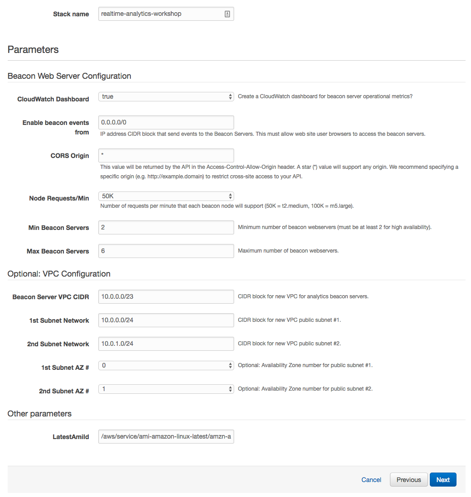

#  Configure a fleet of Web Servers to stream Clickstream data to a Kinesis Firehose delivery stream

## Introduction

In this module, you will start with an AutoScaling group of Apache web servers, and configure them to stream their log data in realtime to a Kinesis Firehose delivery stream. This will prepare for us to perform realtime analytics on the events being captured in these logs.

## Architecture Overview

### 1. Deploy Web Servers using CloudFormation Template

First we need to deploy our web servers in an AutoScaling group, with an Application Load Balancer to accept incoming connections, and scaling policies to scale out (and back in) based on incoming network traffic.

<strong>CloudFormation Launch Instructions (expand for details)</strong>

1.	Right click the **Launch Stack** link below and "open in new tab"

Region| Launch
------|-----
US West (Oregon) | 
US West (N. Virginia) | 

2.	Click **Next** on the Select Template page.
3.	**(Optional)** If you'd like to login to the web servers, select an **SSH Keypair** for this region, select True next to **Enable SSH**, and enter a CIDR block such as `0.0.0.0/0` next to **Enable SSH From**. If you don't have a key pair already created, see ([Creating a key pair using amazon EC2](http://docs.aws.amazon.com/AWSEC2/latest/UserGuide/ec2-key-pairs.html#having-ec2-create-your-key-pair))

4.	Click **Next**.
5.	Click **Next** Again. (skipping IAM advanced section)
6.	On the Review page, check the box to acknowledge that CloudFormation will create IAM resources and click **Create**.

7. While you wait for the CloudFormation stack to be created, download the CloudFormation template by right-clicking here and selecting **Save File As...**: ([Module 1 Starting Template](https://s3-us-west-2.amazonaws.com/realtime-analytics-workshop/1-frontend-module-start.yaml))

When you see the stack showing a CREATE_COMPLETE status, you are ready to move on to the next step.

## 2. Connect the EC2 instance in Ireland (eu-west-1) via RDP

<strong>Connect to your EC2 instance (expand for details)</strong>

1.	From the AWS console, click **Services** and select **EC2**  
2.	Select **Instances** from the menu on the left.
3.	Wait until the newly create instance shows as *running*.
4. Right click on your newly provisoined instance and select **connect** from the menu.

5. Click **Get Password** and select your file .pem (Key Pair), this will decrypt ec2 instance administrator password. Keep a copy of the password for your RDP client.
6. Click **Download Remote Desktop File** and open the file with your RDP client
7. Use the password from step 5 to authenticate and connect your RDP client to your windows instance

Note: For detailed instructions on How To connect to your Windows instance using an RDP client ([Connecting to Your Windows Instance](http://docs.aws.amazon.com/AWSEC2/latest/WindowsGuide/connecting_to_windows_instance.html)).

## Validation Step

<strong>Verify sample data exists on your EC2 instance (expand for details)</strong>

Once you have connected to the Windows Instance via RDP, open the File Explorer and verify that there is a C: drive and a D: drive and that there are JPEG files in the D: drive.

(Optionally) You can add your own unqiue file data to the d: volume by creating a text file or downloading images via firefox within the RDP session.

You now have a Windows instance in Ireland (eu-west-1) that contains a boot volume and a data volume. The secondary volume and it's data will be used as sample data for the other modules in this workshop.

### Start next module

Module 2: [Migrate data to an AWS Storage Gateway volume](../module-2/README.md)

## License

This library is licensed under the Amazon Software License.

[Back to the main workshop scenarios page](../../README.md)
