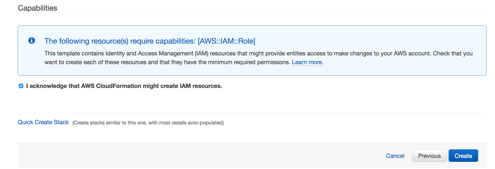
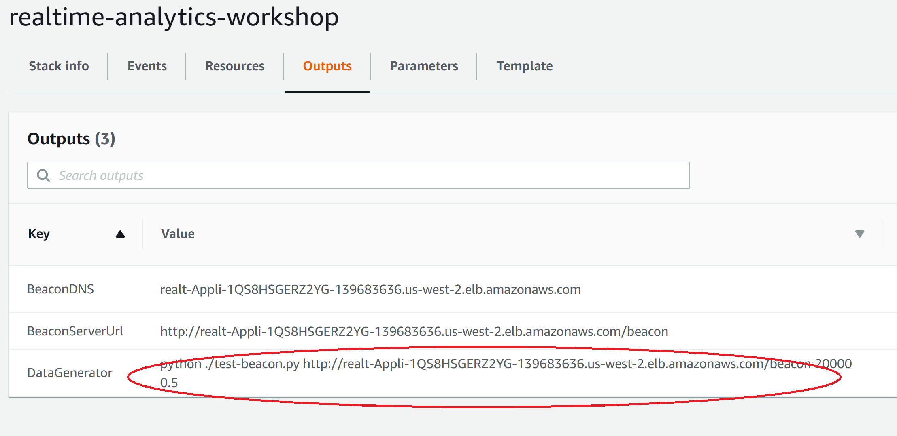
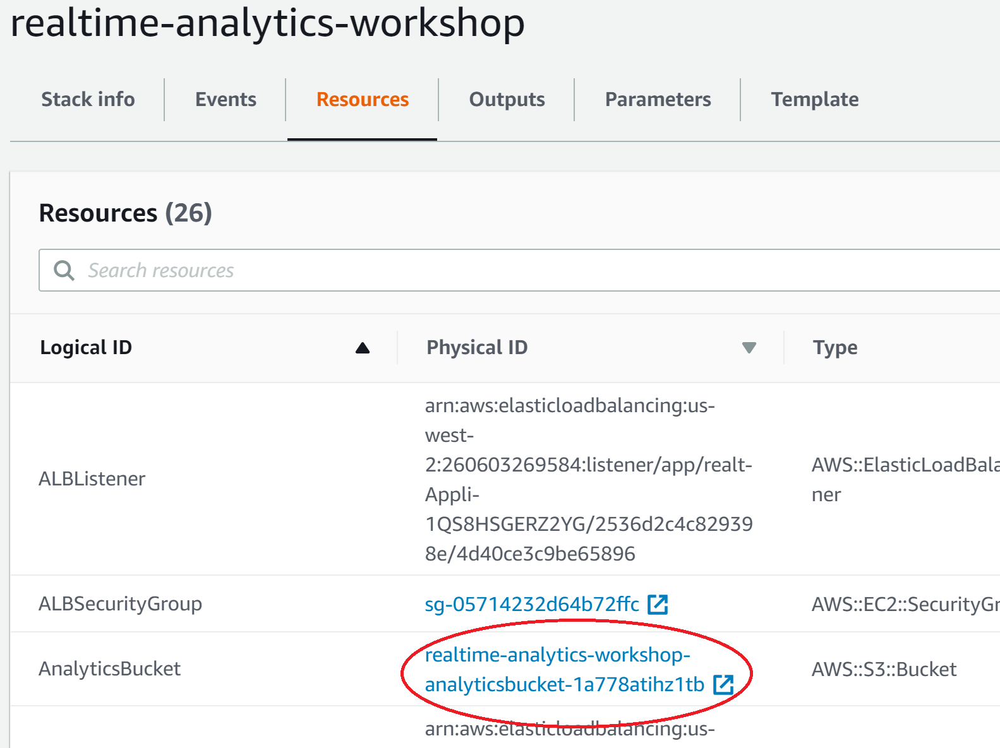
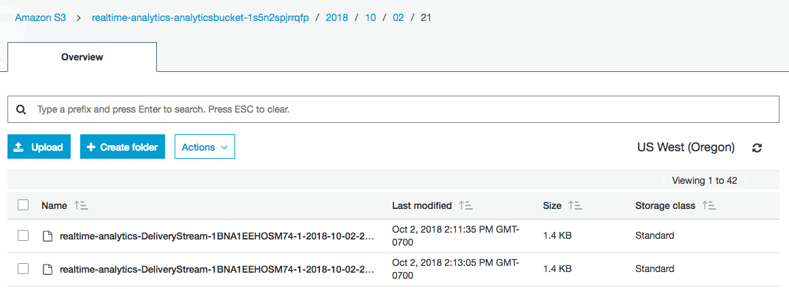

#  Configure a fleet of Web Servers to send Clickstream data to a Kinesis Firehose delivery stream

## Introduction

In this module, you will start with an AutoScaling group of Apache web servers, and configure them to stream their log data in realtime to a Kinesis Firehose delivery stream. This will prepare for us to perform realtime analytics on the events being captured in these logs.

## 1. Deploy Web Servers and Kinesis Resources using CloudFormation Template

First we need to deploy our web servers in an AutoScaling group, with an Application Load Balancer to accept incoming connections, and scaling policies to scale out (and back in) based on incoming network traffic.  We'll also enable them to stream events to Amazon Kinesis through a Launch Configuration that  enables the Kinesis agent to load at startup, configures it to parse the Apache web server's access logs, and publishes the log messages to a Kinesis delivery stream.

<details>
<summary><strong>CloudFormation Launch Instructions (expand for details)</strong></summary><p>

1.	Right click the **Launch Stack** link below and "open in new tab"

Region| Launch
------|-----
EU (Ireland) | [](https://console.aws.amazon.com/cloudformation/home?region=eu-west-1#/stacks/new?stackName=realtime-analytics-workshop&templateURL=https://s3-us-west-2.amazonaws.com/realtime-analytics-workshop/1-frontend-module-finish.yaml)
US West (Oregon) | [](https://console.aws.amazon.com/cloudformation/home?region=us-west-2#/stacks/new?stackName=realtime-analytics-workshop&templateURL=https://s3-us-west-2.amazonaws.com/realtime-analytics-workshop/1-frontend-module-finish.yaml)
US West (N. Virginia) | [](https://console.aws.amazon.com/cloudformation/home?region=us-east-1#/stacks/new?stackName=realtime-analytics-workshop&templateURL=https://s3-us-west-2.amazonaws.com/realtime-analytics-workshop/1-frontend-module-finish.yaml)

2.	Click **Next** on the Select Template page.


3.	Click **Next**.
4.	Click **Next** Again. (skipping IAM advanced section)
5.	On the Review page, check the box to acknowledge that CloudFormation will create IAM resources and click **Create**.



Here's what we just deployed:


You can see that we have a Virtual Private Cloud (VPC) with 2 public subnets, and an Application Load Balancer that connects to a target group consisting of an AutoScaling Group with between 2 and 6 front-end web servers running Apache.  We've also added some CloudWatch alarms that will trigger AutoScaling ScaleUp/ScaleDown events based on the incoming network traffic on the web servers.  This is a typical web front-end fleet.  We've also added the Kinesis Agent to our web servers, and they are delivering their Apache access logs to a Kinesis Firehose delivery stream, which is then putting the events in an S3 bucket for later batch analysis.

While you wait for the stack to finish updating and reach **CREATE_COMPLETE** status, you can move on to the next steps and review the changes we just made to the CloudFormation stack.

</p></details>

## 2. (Optional) Review how the Kinesis Agent was configured on the AutoScaling Group of Web Servers

### Note: There is no need to make any of these edits; you are simply reviewing them to see what changed.

Every AutoScaling Group has a Launch Configuration that is used to configure the EC2 instances when they are launched.  In these code changes, we modified the existing Launch Configuration in the CloudFormation template, configuring the Kinesis agent to install, start automatically on boot, and stream Apache log events to the Kinesis Delivery Stream that we created in the previous section.  We also modified the EC2 instance IAM role to give the EC2 instances permission to send events to the Kinesis Delivery Stream.

<details>
<summary><strong>Configuring Kinesis (expand for details)</strong></summary><p>

1.  In the LaunchConfiguration resource, in the `Metadata` section, under `AWS::CloudFormation::Init`, `config`, `packages`, and `yum`, we added a line that contains `aws-kinesis-agent: []` 

<details>
<summary><strong>See this edit in context (expand for code)</strong></summary>

```YAML
  AutoScalingGroupLaunchConfig:
    Type: AWS::AutoScaling::LaunchConfiguration
    Metadata:
      AWS::CloudFormation::Init:
        config:
          packages:
            yum:
              httpd: []
              aws-kinesis-agent: []
          files:
```

</details>

2.  In the `files` section of the same resource, directly underneath `packages`, we added the file `/etc/aws-kinesis/agent.json` with the following configuration:

<details>
<summary><strong>See this edit in context (expand for code)</strong></summary>

```YAML
          packages:
            yum:
              httpd: []
              aws-kinesis-agent: []
          files:
            /etc/aws-kinesis/agent.json:
              content: !Sub |
                { "cloudwatch.emitMetrics": false,
                  "maxBufferAgeMillis":"1000",
                  "firehose.endpoint": "https://firehose.${AWS::Region}.amazonaws.com",
                  "flows": [
                    {
                     "filePattern": "/var/log/httpd/access_log*",
                      "deliveryStream": "${DeliveryStream}",
                      "partitionKeyOption": "RANDOM",
                      "dataProcessingOptions": [
                      {
                        "optionName": "LOGTOJSON",
                        "logFormat":"COMBINEDAPACHELOG",
                        "matchPattern": "^([\\d.]+) (\\S+) (\\S+) \\[([\\w:/]+\\s[+\\-]\\d{4})\\] \"(.+?)\" (\\d{3}) ([0-9]+) \"(.+?)\" \"(.+?)\" \"(.+?)\" \"(.+?)\" \"(.+?)\" \"(.+?)\" \"(.+?)\" \"(.+?)\" \"(.+?)\"$",
                        "customFieldNames": ["host", "ident", "authuser", "datetime", "request", "response", "bytes", "referrer", "agent", "event", "clientid", "page", "custom_metric_name", "custom_metric_int_value", "custom_metric_float_value", "custom_metric_string_value"]
                      }
                      ]
                    }
                  ]
                }
            /var/www/html/index.html:
```
</details>

3.  In the `commands` section of the same resource, we added the following two commands, which will execute `chkconfig` to add the `aws-kinesis-agent` to `/etc/init.d` and enable it by symlinking it into the appropriate `/etc/rcX.d` directories so that it will launch on startup:

<details>
<summary><strong>See this edit in context (expand for code)</strong></summary>

```YAML
            ad-add-service-aws-kinesis-agent:
              command: chkconfig --add aws-kinesis-agent
            ae-add-service-startup-aws-kinesis-agent:
              command: chkconfig aws-kinesis-agent on
```
</details>

4.  Next, also in the `commands` section of the same resource, we added the following command, which will modify the Apache log format to include a data header:

<details>
<summary><strong>See this edit in context (expand for code)</strong></summary>

```YAML
            ca-add-data-header:
              command: sed -i 's/LogFormat "%h %l %u %t \\"%r\\" %>s %b \\"%{Referer}i\\"
                \\"%{User-Agent}i\\"" combined/LogFormat "%h %l %u %t \\"%r\\" %>s
                %b \\"%{Referer}i\\" \\"%{User-Agent}i\\" \\"%{event}i\\" \\"%{clientid}i\\"
                \\"%{page}i\\" \\"%{custom_metric_name}i\\" \\"%{custom_metric_int_value}i\\" \\"%{custom_metric_float_value}i\\" \\"%{custom_metric_string_value}i\\"" combined/' /etc/httpd/conf/httpd.conf
```
</details>

5.  Next, we also added the `aws-kinesis-agent` to the `services` section of the same resource.  This will ensure that the service is running:

<details>
<summary><strong>See this edit in context (expand for code)</strong></summary>

```YAML
              aws-kinesis-agent:
                enabled: 'true'
                ensureRunning: 'true'
                files:
                  - /etc/init.d/aws-kinesis-agent
```
</details>

6.  Next, we added a new IAM policy to the `WebServerKinesisRole` resource, which will give it permission to put event records on the Kinesis Delivery Stream.  This is located where the `Policies:` section begins:

<details>
<summary><strong>See this edit in context (expand for code)</strong></summary>

```YAML
      Policies:
        - PolicyName: puttofirehose
          PolicyDocument:
            Version: '2012-10-17'
            Statement:
              - Effect: Allow
                Action:
                  - firehose:PutRecord
                  - firehose:PutRecordBatch
                Resource:
                  - !GetAtt 'DeliveryStream.Arn'
        - PolicyName: ssmagent
```
Note: again, we are using resource-based permissions to implement the security best practice of least privilege, by referring to `!GetAtt 'DeliveryStream.Arn'`

</details>

## 2a. (Optional) Review the Kinesis Resources that were added to the CloudFormation stack

### Note: There is no need to make any of these edits; you are simply reviewing them to demonstrate how you would enable streaming a log file to Kinesis.

1.  The first thing that was added to the stack was an S3 analytics bucket resource, as well as a Kinesis Firehose Delivery Stream that will deliver events to it.  

<details>
<summary><strong>AnalyticsBucket Resource (expand for code)</strong></summary>

```YAML
# Kinesis Application
  AnalyticsBucket:
    Type: AWS::S3::Bucket
    DeletionPolicy: Retain
```

</details>

2.	The next thing that was added to the stack was an IAM Role and Policy that will give the Kinesis Delivery Stream permissions to deliver the events directly below the S3 bucket resource:  

<details>
<summary><strong>DeliveryStreamRole Resource (expand for code)</strong></summary>

```YAML
  DeliveryStreamRole:
    Type: AWS::IAM::Role
    Properties:
      AssumeRolePolicyDocument:
        Version: '2012-10-17'
        Statement:
          - Effect: Allow
            Principal:
              Service:
                - firehose.amazonaws.com
            Action:
              - sts:AssumeRole
      Policies:
        - PolicyName: s3Access
          PolicyDocument:
            Version: '2012-10-17'
            Statement:
              - Sid: ''
                Effect: Allow
                Action:
                  - s3:AbortMultipartUpload
                  - s3:GetBucketLocation
                  - s3:GetObject
                  - s3:ListBucket
                  - s3:ListBucketMultipartUploads
                  - s3:PutObject
                Resource:
                  - !Sub '${AnalyticsBucket.Arn}'
                  - !Sub '${AnalyticsBucket.Arn}/*'
              - Sid: ''
                Effect: Allow
                Action:
                  - logs:PutLogEvents
                Resource:
                  - !Sub 'arn:aws:logs:${AWS::Region}:${AWS::AccountId}:log-group:/aws/kinesisfirehose/*:log-stream:*'
```
Note: We are following the _principle of least privilege_ by enabling resource-level permissions and referencing the `AnalyticsBucket` as `!Sub '${AnalyticsBucket.Arn}'`

</details>

3. We also added a Kinesis Delivery Stream resource directly below the IAM Role:  

<details>
<summary><strong>DeliveryStream Resource (expand for code)</strong></summary>

```YAML
  DeliveryStream:
    Type: AWS::KinesisFirehose::DeliveryStream
    Properties:
      DeliveryStreamType: DirectPut
      S3DestinationConfiguration:
        BucketARN: !Sub '${AnalyticsBucket.Arn}'
        BufferingHints:
          IntervalInSeconds: '60'
          SizeInMBs: '1'
        CompressionFormat: UNCOMPRESSED
        RoleARN: !GetAtt 'DeliveryStreamRole.Arn'
```
Note: By setting `IntervalInSeconds` to `60` and `SizeInMBs` to `1`, we are configuring the Kinesis Delivery Stream to deliver events to the S3 bucket whenever either 60 seconds has elapsed, or more than 1MB of event data is in the stream.  Whenever either of these conditions is met, the events will be delivered.

</details>

</p></details>

## 3. Generating Random Web Traffic for Processing

In this section you will execute a python script that posts http header data to your front end web servers.  To make it easy we added an output variable in the stack that contains the command line needed to generate web traffic sent to your ELB.  

<details>
<summary><strong>Execute the python script to simulate web traffic. (expand for details)</strong></summary><p>

1.  In the AWS Console select CloudFormation to view the Stacks and check the box to the left of your stack that you just updated. 


2.  Select the Outputs tab to display the output variables for your stack. 
3.  Locate the DataGenerator key and copy the Value from the browser.



4.  The python script, `test-beacon.py` is located in the `module-1/` folder in the GitHub repository that you should have checked out.  If you have trouble locating it, you can also find it ([here.](test-beacon.py))  Open a terminal or command window, navigate to the folder that contains the test-beacon.py script and execute the command.  If the post messages are sent successfully to the load balancer, you should see an incrementing count in the terminal window.  You can leave this running for the rest of the workshop.


<details>
<summary><strong>Example Command (expand for details)</strong></summary>

If you are using the Cloud9 environment your repository was checked out underneath an `environment` subdirectory:
```bash
  cd ~/environment/realtime-web-analytics-workshop/module-1/
  python ./test-beacon.py http://<loadbalancer>.us-east-1.elb.amazonaws.com/beacon 20000 0.5
```

Or, assuming you checked out the GitHub repository to your home directory:
```bash
  cd ~/realtime-web-analytics-workshop/module-1/
  python ./test-beacon.py http://realt-Appli-1P8C8FJ52YGXM-EXAMPLE.us-east-1.elb.amazonaws.com/beacon 20000 0.5
```

*  The first parameter is the address for the load balancer.  Your DNS entry will be different than the example here.
*  The second parameter is the number of requests to send before ending the script.  In this case the script will simulate 20,000 web requests.
*  The last parameter is the number of seconds to delay between sending requests.  Using these values the script should generate data for over two hours.

Note: if you get an error indicating a module is not installed such as **requests** you can install it locally using:

`pip install requests -t .`

</details>

</details>

## 4. Verify that the Kinesis Firehose Delivery Stream is Delivering Events to S3

To confirm that everything is setup properly, we can verify that events are being delivered from the web servers to the S3 analytics bucket by the Kinesis Firehose Delivery Stream.

<details>
<summary><strong>Kinesis Firehose Delivery Stream verification (expand for details)</strong></summary><p>

1.	Navigate in the AWS console to **Services**, then **CloudFormation**.
2.  Select the CloudFormation stack that you deployed in step 1 of this module.
3.  Click on the **Resources** tab in the bottom half of the screen, and find the `AnalyticsBucket` resource, then click on the link in the `Physical ID` column to navigate there:



4.  Once you navigate to the bucket folder structure, it should look like this:


5.  Navigate all the way down into the folder structure (it is organized by year, month, day, hour, etc.) until you see individual objects that are collections of events that were delivered by the Kinesis Firehose Delivery Stream:



If you see folders and objects inside the folders that were delivered by the Kinesis Firehose Delivery Stream, everything is working correctly, and you can proceed to the next module.

</p></details>

### Start next module

Module 2: [Performing Realtime Analytics with Kinesis Analytics](../module-2/README.md)

## License Summary

Copyright 2018 Amazon.com, Inc. or its affiliates. All Rights Reserved.

This sample code is made available under a modified MIT license. See the LICENSE file.

[Back to the main workshop page](../README.md)