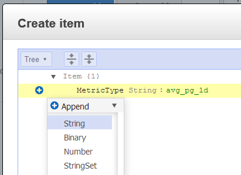
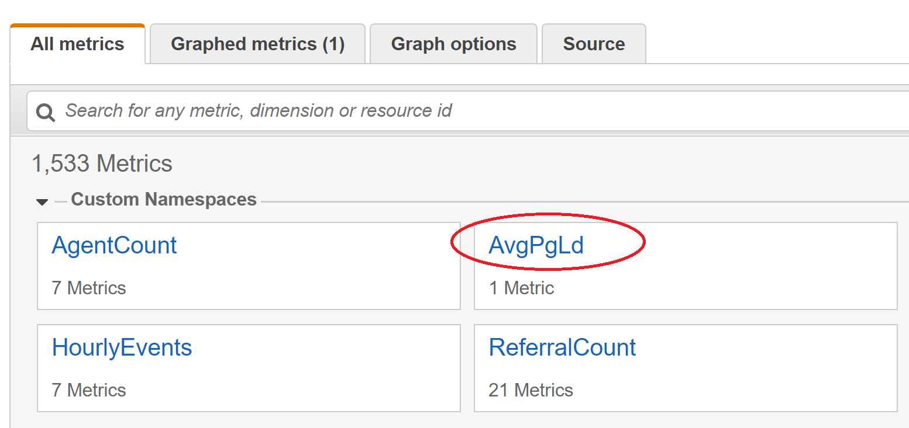

# Adding Custom Metrics and Extending the Solution
## Introduction

In this module you will customize the solution to accept another metric not currently captured.  Is there a specific metric you would like to capture from your web site that isn't already included in the metrics displayed?  We'll show you how this solution can be easily extended to capture and display new metrics.

##  Add a Custom Metric

It may be useful to know how long pages on your website take to load. You could track averages, maximums, minimums, compare performance of different browsers, etc.  Here, we'll show you how to add a custom metric that calculates the average page load time for all pages measured on your target site.   

<details>
<summary><strong>Capture Load Time on Target Website (expand for details)</strong></summary><p>

You can capture page load times by injecting JavaScript in your website that captures the current time when from the header and compare that to the time when the page loads or is ready.

Here are some examples that you would use on the site you are measuring.  

```HTML
    <head>
        <script type="text/javascript">
            var pageStart = Date.now();
        </script>
    </head>
```  
... 
```HTML
    <body>
        <script type="text/javascript">
            $(window).load(function() {
                var loadTime = Date.now() - pageStart;
                //post load time to beacon servers here
                http.open("POST", beacon_url);//use URL of ELB
                http.setRequestHeader("custom_metric_name", "page_load_time");
                http.setRequestHeader("custom_metric_int_value", loadTime);
                http.send();
            });
            $(document).ready(function() {
                var readyTime = Date.now() - pageStart;
                //post page ready time to beacon servers here
            });
        </script>
    </body>
```
This code is just an example of what would be added to your measured website.  For the workshop we will simulate traffic with a Python script.  

</details>

<details>
<summary><strong>Add the Metric to the DynamoDB Table (expand for details)</strong></summary><p>    

The Lambda processing function reads from the DynamoDB **stack-name**-Metric table to determine how to process metrics that are persisted to the MetricDetails table.  In this example you will add a metric that captures the average load time for all captured pages on the target website.  
The DynamoDB table named **stack-name**-Metrics initially contains seven items representing different metrics.  Each item contains the following information is required for each metric type:
*   **MetricType** - a primary partition key to identity the metric
*   **AmendmentStrategy** - this is a field to indicate how to late arriving records for an existing event time. Valid values are [add | replace | replace_existing].  **add** combines the values of the existing item and the new item, **replace** replaces the metric in DynamoDB with the newly arrived item, **replace_existing** only replaces the matching metrics in the set of metrics in the item.  
*   **IsSet** - indicates if the detail item contains one or more metric items [true | false]. 
*   **IsWholeNumber** - indicates if the numeric metric is an integer or float value [true | false].  
*   **LastEventTimestamp** - this is an integer field used to track the latest metrics.  

1.  Navigate to DynamoDB in the console, select **Tables** from the left side menu.
2.  Select the radio button to select the **stack-name**-Metrics table. 
3.  Click the Items tab to see the seven default metrics.
4.  Click the **Create item** button to add a new item.
5.  Enter **avg_pg_ld** in the String field for the MetricType.  
6.  Click the plus (+) on the left and select Append and String. For FIELD, enter **AmendmentStrategy** and for value enter **replace**  



7.  Use the same method and append **IsSet** Boolean : false, **IsWholeNumber** Boolean : true, **LatestEventTimestamp** Number : 0 
Note: Ensure you select the type **Boolean** and not Binary. 


8.  Click **Save** to create the new item.

Note:
*   We are using the replace amendment strategy which means that if a subsequent average comes in for the same event time window which has already been received, the new value will be used. 
*   We are using a single value for all cases for each time window indicated by IsSet: false.  If we wanted to break out additional data such as browser type, page, etc. we could instead use a set with different SQL in the Kinesis application.
*   We are using IsWholeNumber: true since the metric value we will be using is the average number of milliseconds in whole milliseconds.  
*   The metric type **avg_pg_ld** is differnt than the custom metric name **page_load_time** which is what gets sent into the beacon servers.  The SQL in the Kinesis application uses the page load time values to calculate the average page load times over a one minute window and emits the average.
</details>

<details>
<summary><strong>Simulate Load Times via Python Script (expand for details)</strong></summary><p>  

To simulate page load times you will create a Python script similar to the **test-beacon.py** script you used earlier.  
Open a text editor and add the following:  

```python
# Usage
# `python generate-load-times.py <BEACONURL> 10000 0.5`

import requests
import random
import sys
import argparse
import time

def generateRandomLoadTime():
    return random.randint(10,10000)

parser = argparse.ArgumentParser()
parser.add_argument("target", help="<http...> the http(s) location to send the GET request")
parser.add_argument("calls", help="the number of HTTP calls to make")
parser.add_argument("delay", help="the time in seconds to delay between calls (ie 0.5 is half a second)")

args = parser.parse_args()
i = 0
s = requests.Session()

while (i < int(args.calls)):
    time.sleep(float(args.delay))
    loadTime = generateRandomLoadTime()
    headers = {'custom_metric_name' : 'page_load_time', 'custom_metric_int_value' : str(loadTime) }
    r = s.post(args.target + '?call=' + str(i),headers=headers)
    if(r.status_code==200):
        sys.stdout.write( str(i) + "-")
    else:
        sys.stdout.write( str(i) + "---->" + str(r.status_code) + "\n")
    sys.stdout.flush()
    i+=1
```
Then execute the script replacing the **BEACONURL** with the ELB for your pipeline:  

```bash
    python generate-load-times.py <BEACONURL> 10000 0.5
```

</details>


<details>
<summary><strong>Create SQL to calculate average page load (expand for details)</strong></summary><p>    

1.  Go to Kinesis in the console.
2.  Select your Kinesis analytics application.
3.  Click on the **Go to SQL results** button.  


4.  Create a pump that takes the incoming records where the **custom_metric_name** is **page_load_time** and calculate an average over a one minute window.  
<details>
<summary><strong>SQL Statement (expand for code)</strong></summary><p>    

Leave the existing SQL in the editor and add the following to the end of the existing SQL statements.

```SQL
CREATE OR REPLACE PUMP "PAGELOAD_PUMP" AS
INSERT INTO "DESTINATION_SQL_STREAM" (MetricType, EventTimestamp,MetricItem, UnitValueInt)
SELECT 
    'avg_pg_ld', 
    UNIX_TIMESTAMP(eventTimestamp), 
    MetricItem,
    average_ms 
    FROM (
        SELECT STREAM 'All Pages' as MetricItem,
        AVG(weblogs."custom_metric_int_value") as average_ms,
        STEP (CHAR_TO_TIMESTAMP('dd/MMM/yyyy:HH:mm:ssz',weblogs."datetime") by INTERVAL '10' SECOND) as eventTimestamp
        FROM "WASA_001" weblogs
        WHERE weblogs."custom_metric_name" = 'page_load_time'
        GROUP BY
        STEP (weblogs.ROWTIME BY INTERVAL '10' SECOND),
        STEP (CHAR_TO_TIMESTAMP('dd/MMM/yyyy:HH:mm:ssz',weblogs."datetime") by INTERVAL '10' SECOND)
    ); 
```
Notes:
*   The inner SQL statement selects all (and only) records that have the custom metric name **page_load_time**.  All of these are averaged across the window and put into the 'All Pages' MetricItem. You could also group by other attributes such as **page**, **User-Agent**, etc. and put that in MetricItem to track results by these attributes. 
*   The GROUP BY time based steps used in this workshop have both steps for **ROWTIME** and the event time as captured by **weblogs."datetime"**.  The statement **STEP (weblogs.ROWTIME BY INTERVAL '60' SECOND)** creates a one minute tumbling window where only one record is output per minute based on all the records received by Kinesis Data Analytics that match the select criteria. ROWTIME is created by Kinesis Data Analytics when it puts the row into the first in-application stream.  The second STEP uses the data received from the logs on the web servers to align the group by.  Typically there will be a one-to-one match between the ROWTIME and datetime.  However, in some cases the source producer could run behind in sending data to Kinesis.  For example, if the Kinesis Agent was to be updated on one server it may get more than a minute behind then send the weblogs later than other servers.  In this case the amendment strategy would determine what to do with the new data for the metric already recorded.  This additional complexity may be more suited to handle IoT scenarios where client producers may be less reliable and timely than identical web servers in the same region.  


</details>
</details>

<details>
<summary><strong>Create a new CloudWatch graph to show average page load (expand for details)</strong></summary><p>
  
Navigate to CloudWatch Metrics and select the new Metric **AvgPgLd** and create a graph.

 

</details>


### Next Steps

If you have made it to this point in the Workshop you are a real time analytics ninja, unicorn, or both.  Congratulations! Here are some useful next steps to even more value out of the solution.  
*   Create a Glue Crawler pointing it to the S3 bucket being populated by the Kinesis Firehose delivery stream.  Run the crawler and create a table with partitions in the Glue Data Catalog.  Select the table in AWS Glue and select **Action** then **View data** to run queries on the data in S3 using Athena.  You can also now query this data from within EMR or Redshift Spectrum using the external table created in the Glue Data Catalog.
*   Update the average page load time metric to also include the page where the load time was generated. You will change the IsSet in the Metrics table to true.  Also change the SQL to select the page name for MetricItem instead of using 'All Pages'.
*   Create a notification email when the event_anomaly score exceeds a threshold of 2.0.  Create a new **stream** in SQL that will contain the anomaly records.  Copy the existing ANOMALY_EVENT_PUMP statement and add it back with a new name.  Change the stream that is being inserted into to the anomaly stream just created.  Add a WHERE clause to only emit events that are sufficiently anomalous **WHERE AnomalyScore > 2.0**.  Create a Lambda function that sends an SNS message to a topic that is subscribed to by SES. Create a new destination in your Kinesis application for your anomaly stream and connect it to the Lambda function.  The data generated from the **test-becon.py** script is random but evenly distributed across the possible values.  The anomaly detection functionality will identify this normal pattern and therefore likely emit a score lower than 2.0.  To create an anomaly run the **click-burst.py** script which will elevate the click count for 3 minutes elevating the anomaly scores.


## License Summary

Copyright 2018 Amazon.com, Inc. or its affiliates. All Rights Reserved.

This sample code is made available under a modified MIT license. See the LICENSE file.

[Back to the main workshop page](../README.md)
